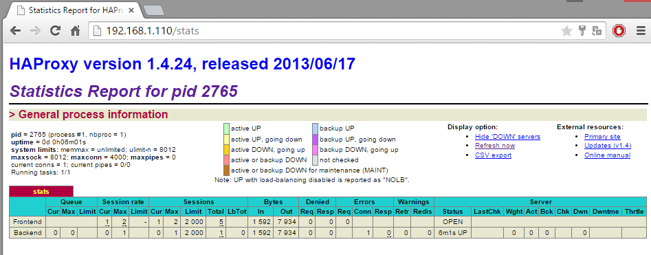

Lo primero que haremos será configurar Haproxy para que actué como balanceador de carga y
Keepalived para que compruebe el estado de nuestra IP virtual (Nuestro recurso en cluster). La
IP que hemos elegido será la 192.168.1.150 (Más tarde servirá para entrar a Horizon).

## HAPROXY

HAProxy es una solución gratuita , muy rápido y fiable que ofrece alta disponibilidad, balanceo
de carga y proxy para TCP y aplicaciones basadas en HTTP . Es especialmente adecuado para
los sitios web de alto tráfico y bastante visitados del mundo. Con los años se ha convertido en
el equilibrador de carga de código abierto estándar por defecto , ahora se incluye con la
mayoría de las principales distribuciones de Linux , y con frecuencia se despliega por defecto
en plataformas de cloud.

Su modo de funcionamiento hace que su integración en arquitecturas existentes sea muy fácil
y sin riesgo , sin dejar de ofrecer la posibilidad de no exponer los servidores web frágiles a la
red , como a continuación:

## KEEPALIVED

Keepalived es un software de enrutamiento escrito en C. El objetivo principal de este proyecto
es proporcionar instalaciones simples y robustas para balanceadores de carga y de alta
disponibilidad para los sistemas Linux y las infraestructuras basadas en Linux. Keepalived
implementa un conjunto de "fichas" para mantener y administrar grupo de servidores en
equilibrio de carga de acuerdo a su "salud" de forma dinámica y adaptativa. Por otra parte, la
alta disponibilidad se consigue mediante el protocolo VRRP. VRRP es un pilar fundamental para
la conmutación por error.

Keepalived es software libre; puedes redistribuirlo y / o modificarlo bajo los términos de la
Licencia Pública General GNU publicada por la Fundación para el Software Libre; ya sea la
versión 2 de la Licencia, o (a su elección) cualquier versión posterior.

## INSTALACIÓN Y CONFIGURACIÓN

Los dos servidores de Proxy son Hera y Afrodita (Ver tabla), estos dos servidores poseen una
interfaz en modo puente para acceder de manera "pública".

La configuración que vamos a realizar se debe de hacer en los dos nodos.

Lo primero será configurar la interfaz de red puente. La añadimos en virt-manager en remoto y
la añadimos en **/etc/network/interfaces**:

~~~
auto eth1
iface eth1 inet static
		address 192.168.1.110
		netmask 255.255.255.0
		gateway 192.168.1.1
		dns-nameserver 8.8.8.8
~~~

Y levantamos la interfaz:

~~~
ifup eth1
~~~

>**ERROR**: Nos encontramos que cuando encendemos las máquinas quedan esperando la
configuración de red desde el servidor DHCP (Cuando tienen configuradas una IP estática),
demorando su arranque bastante tiempo.

>**SOLUCIÓN**: Encontramos la solución:
>[http://www.linuxquestions.org/questions/linux-server-73/ubuntu-14-04-incredibly-slow-
boot-without-network-4175510497/](http://www.linuxquestions.org/questions/linux-server-73/ubuntu-14-04-incredibly-slow-
boot-without-network-4175510497/])

>Procedemos a comentar en el fichero /etc/init/failsafe.conf las dos líneas siguientes:

~~~
$PLYMOUTH message --text="Waiting for network configuration..." || :
sleep 40
$PLYMOUTH message --text="Waiting up to 60 more seconds for network
configuration..." || :
sleep 59
$PLYMOUTH message --text="Booting system without full network
configuration..." || :
~~~

>Y así obtenemos un tiempo de inicio aceptable.

Ahora, debemos configurar el kernel para que entienda que tendremos una ip adicional que no
está definida en el archivo de interfaces. Para ello editamos el fichero **/etc/sysctl.conf**:

~~~
net.ipv4.ip_nonlocal_bind=1
~~~

Para que surta efecto sin reiniciar:

~~~
nsysctl -p
~~~

Actualizamos e instalamos los paquetes necesarios:

~~~
apt-get update && apt-get install keepalived haproxy -y
~~~

Creamos el fichero de configuración **/etc/keepalived/keepalived.conf**:
~~~
global_defs {
  router_id hera
}
vrrp_script haproxy {
  script "killall -0 haproxy"
  interval 2
  weight 2
}
vrrp_instance 50 {
  virtual_router_id 50
  advert_int 1
  priority 101
  state MASTER
  interface eth1
  virtual_ipaddress {
    192.168.1.150 dev eth1
  }
  track_script {
    haproxy
  }
}
~~~

\*Advertencia para el segundo nodo: En la opción router_id especificamos el hostname. Y la IP
Virtual aquí es donde la especificamos.

El siguiente paso es configurar el fichero **/etc/haproxy/haproxy.cfg**:

~~~
global
		chroot /var/lib/haproxy
		user haproxy
		group haproxy
		daemon
		log 192.168.1.110 local0
		stats socket /var/lib/haproxy/stats
		maxconn 4000
defaults
		log		global
		mode	http
		#option httplog
		option dontlognull
		contimeout 5000
		clitimeout 50000
		srvtimeout 50000
		errorfile 400 /etc/haproxy/errors/400.http
		errorfile 403 /etc/haproxy/errors/403.http
		errorfile 408 /etc/haproxy/errors/408.http
		errorfile 500 /etc/haproxy/errors/500.http
		errorfile 502 /etc/haproxy/errors/502.http
		errorfile 503 /etc/haproxy/errors/503.http
		errorfile 504 /etc/haproxy/errors/504.http
listen stats 192.168.1.110:80
		mode http
		stats enable
		stats uri /stats
		stats realm HAProxy\ Statistics
		stats auth admin:password
~~~

\*vertencia para el segundo nodo: Debemos especificar la IP correcta en log location y en
stats listener. En stats auth ponemos el usuario y contraseña que queramos para acceder a la
página de estadísticas que se crea con esa configuración a la que más tarde accederemos para
comprobar que todo va correctamente.

Ahora habilitamos haproxy en el fichero **/etc/default/haproxy**:

~~~
ENABLED=1
~~~

Reiniciamos los servicios:

~~~
service keepalived restart
service haproxy restart
~~~

Ya podemos acceder a la página de estadisticas de este nodo y además en el primer nodo
configurado podemos poner la instrucción a continuación para comprobar que esta la IP
Virtual activa:

~~~
root@hera:/home/usuario# ip a | grep eth1
3: eth1: <BROADCAST,MULTICAST,UP,LOWER_UP> mtu 1500 qdisc pfifo_fast state UP
group default qlen 1000
	inet 192.168.1.110/24 brd 192.168.1.255 scope global eth1
	inet 192.168.1.150/32 scope global eth1
~~~

Y podemos hacer ping a ella:

~~~
PING 192.168.1.150 (192.168.1.150) 56(84) bytes of data.
64 bytes from 192.168.1.150: icmp_seq=1 ttl=64 time=1.10 ms
64 bytes from 192.168.1.150: icmp_seq=2 ttl=64 time=0.552 ms
^C
--- 192.168.1.150 ping statistics ---
2 packets transmitted, 2 received, 0% packet loss, time 1001ms
rtt min/avg/max/mdev = 0.552/0.826/1.100/0.274 ms
~~~

Si el nodo activo cae o se reinicia, rápidamente el nodo 2 activa la IP Virtual.