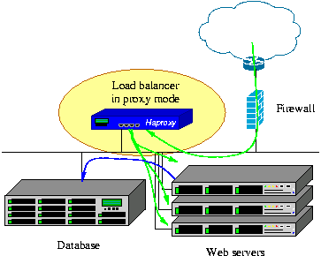

Lo primero que haremos será configurar Haproxy para que actué como balanceador de carga y
Keepalived para que compruebe el estado de nuestra IP virtual (Nuestro recurso en cluster). La
IP que hemos elegido será la 192.168.1.150 (Más tarde servirá para entrar a Horizon).

## HAPROXY

HAProxy es una solución gratuita , muy rápido y fiable que ofrece alta disponibilidad, balanceo
de carga y proxy para TCP y aplicaciones basadas en HTTP . Es especialmente adecuado para
los sitios web de alto tráfico y bastante visitados del mundo. Con los años se ha convertido en
el equilibrador de carga de código abierto estándar por defecto , ahora se incluye con la
mayoría de las principales distribuciones de Linux , y con frecuencia se despliega por defecto
en plataformas de cloud.

Su modo de funcionamiento hace que su integración en arquitecturas existentes sea muy fácil
y sin riesgo , sin dejar de ofrecer la posibilidad de no exponer los servidores web frágiles a la
red , como a continuación:

Hacemos una snapshot de cada máquina con:

~~~
root@olimpo:/home/usuario/Snapshots# virsh start maquina
root@olimpo:/home/usuario/Snapshots# virsh save maquina nombre_snapshot
root@olimpo:/home/usuario/Snapshots# ls
afrodita_0 ares_0 atenea_0 zeus_0
apolo_0 artemisa_0 hades_0 hera_0 poseidon_0
~~~