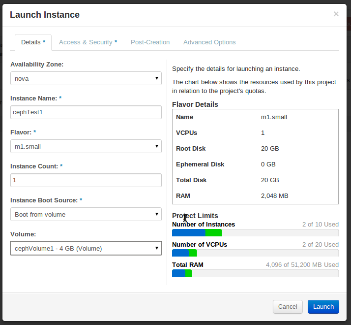

En este apartado realizaremos la prueba final para conseguir sacar partido a nuestro cloud en HA. Instanciaremos desde un volumen que esta en Ceph. Con esto conseguiremos recuperar instancias perdidas tan solo volviendo a instanciar desde el volumen creado.

###CONFIGURACIÓNES

Para configurar nuestro nodo de computación (Ares y Atenea) necesitamos acceso al cluster de Ceph para obtener algunas cosas. Para ello, habilitaremos acceso por ssh desde Ares a Poseidon (Nodo 1 del cluster de Ceph, 192.168.100.14), entramos en Poseidon y realizamos estos pasos:

~~~
ssh 192.168.1.17 "sudo mkdir -p /etc/ceph; sudo tee /etc/ceph/ceph.conf" < /etc/ceph/ceph.conf
ceph auth get-key client.icehouse | ssh 192.168.1.17 tee client.icehouse.key
ceph auth get-or-create client.icehouse | ssh 192.168.1.17 sudo tee /etc/ceph/ceph.client.icehouse.keyring
~~~

Ahora volvemos a Ares e instalamos estos paquetes:

~~~
apt-get install ceph-common python-ceph
~~~

Ahora en Ares (EL primer nodo de computación) seguimos estos pasos:

~~~
cd ~
UUID=$(uuidgen)
cat > secret.xml <<EOF
<secret ephemeral='no' private='no'>
  <uuid>$UUID</uuid>
  <usage type='ceph'>
    <name>client.icehouse secret</name>
  </usage>
</secret>
EOF
sudo virsh secret-define --file secret.xml
sudo virsh secret-set-value --secret $UUID --base64 $(cat client.icehouse.key) echo $UUID
~~~

En el siguiente nodo de computación (Atenea) y en los posibles futuros nodos de computación los pasos son los siguientes:

~~~
cd ~
UUID=[uuid igual que en el nodo primero]
cat > secret.xml <<EOF
<secret ephemeral='no' private='no'>
  <uuid>$UUID</uuid>
  <usage type='ceph'>
    <name>client.icehouse secret</name>
  </usage>
</secret>
EOF
sudo virsh secret-define --file secret.xml
sudo virsh secret-set-value --secret $UUID --base64 $(cat client.icehouse.key)
echo $UUID
~~~

Ahora configuramos Nova algunos detalles para lo que buscamos:

~~~
[DEFAULT]
...
libvirt_images_type=rbd
libvirt_images_rbd_pool=datastore
libvirt_images_rbd_ceph_conf=/etc/ceph/ceph.conf
rbd_user=icehouse
rbd_secret_uuid=[uuid from the last command]
libvirt_inject_password=false
libvirt_inject_key=false
libvirt_inject_partition=-2
...
~~~

Y reiniciamos el servicio:

~~~
service nova-compute restart
~~~

Ahora ya podemos testearlo. El proceso será crear un volumen en Cinder desde una imágen de Glance. La imágen de Glance deberá estar en formato **RAW**. Vamos a nuestro nodo controlador Zeus y convertimos la imagen cirros que teniamos en formato RAW

~~~
qemu-img convert -f qcow2 -O raw cirros-0.3.4-x86_64-disk.img cirros-0.3.4-x86_64-disk.raw
~~~

Y la subimos a nuestro cloud con estos pasos:

~~~
source admin-openrc.sh
glance image-create --name cirrosRaw --is-public=true --disk-format=raw --container-format=bare < cirros-0.3.4-x86_64-disk.raw
glance image-list

# glance image-list
+--------------------------------------+------------+-------------+------------------+----------+--------+
| ID                                   | Name       | Disk Format | Container Format | Size     | Status |
+--------------------------------------+------------+-------------+------------------+----------+--------+
| 7b15fbd6-bbf3-4a13-81be-85f2384e63c5 | cirros     | qcow2       | bare             | 13147648 | active |
| 262fb084-8b5d-4567-8247-be11102dec8a | cirrosRaw  | raw         | bare             | 41126400 | active |
+--------------------------------------+------------+-------------+------------------+----------+--------+
~~~

Ahora crearemos nuestro volumen en Cinder, podemos hacerlo desde Horizon o desde linea de comandos (Utilizando la id de nuestra imagen en formato RAW):

~~~
cinder create --image-id 262fb084-8b5d-4567-8247-be11102dec8a --display-name cephVolume1 4
~~~

Finalmente desde Horizon podemos ver el instanciado de la máquina desde un volumen en Ceph:

Esto es la clave de la alta disponibilidad. Si nuestros nodos de computación se pierden por supuesto nuestra instancia se perderá, pero, NO sus datos que están en el volumen y replicados por el cluster de Ceph a  buen recaudo. Simplemente lanzariamos una nueva instancia desde ese volumen que utilizamos.